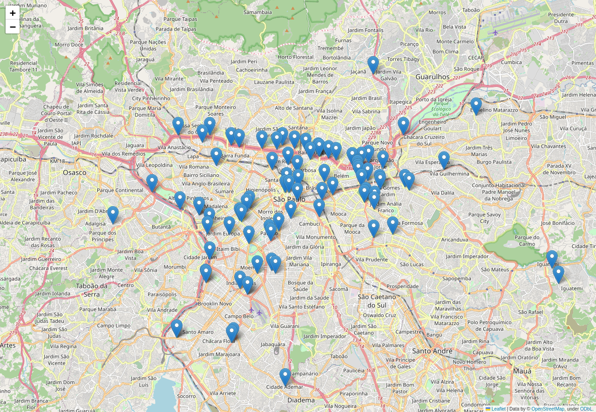

# Post Denúncia

[](https://opensource.org/licenses/MIT) [](https://github.com/esign-consulting/postdenuncia/actions?query=workflow%3A%22Java+CI%22) [](https://snyk.io/test/github/esign-consulting/postdenuncia)

- [3 anos de Post Denúncia](http://www.esign.com.br/2016/05/20/3-anos-de-post-denuncia)
- [Mapa brasileiro de qualidade do ar](http://www.esign.com.br/2016/05/25/mapa-brasileiro-de-qualidade-do-ar)
- [Post Denúncia na trilha Smart Cities do TDC 2016 São Paulo](http://www.esign.com.br/2016/07/12/post-denuncia-na-trilha-smart-cities-do-tdc-2016-sao-paulo)
- [Como adicionar o mapa de qualidade do ar no seu site ou app](http://www.esign.com.br/2016/08/05/como-adicionar-o-mapa-de-qualidade-do-ar-no-seu-site-ou-app)
- [Fim do Post Denúncia](http://www.esign.com.br/2017/02/24/fim-do-post-denuncia)

## Mapa de denúncias de fumaça preta

As localizações das denúncias de fumaça preta feitas na cidade de São Paulo através do aplicativo Post Fumaça Preta podem ser visualizadas no mapa abaixo:



Para gerar o mapa, execute:

```
python3 -m venv env
source env/bin/activate
pip3 install -r fumaca-preta/requirements.txt
./fumaca-preta/mapa-denuncias-sao-paulo-sp.py
```
